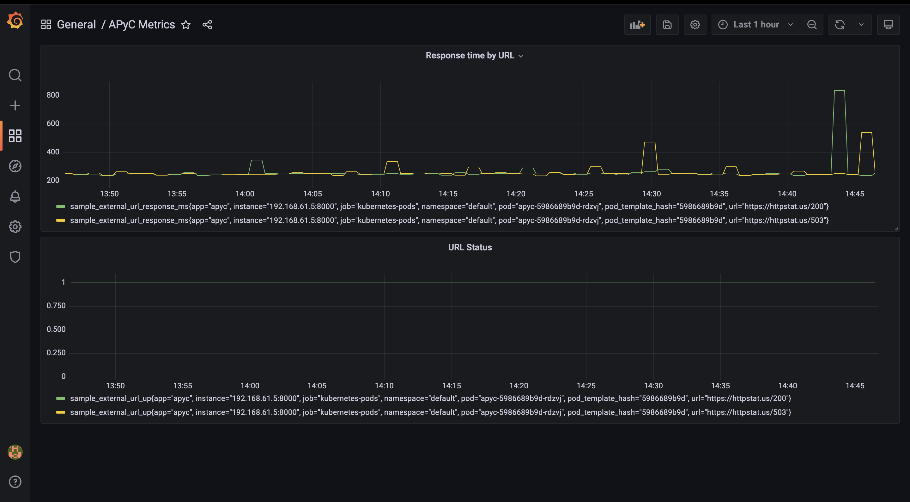
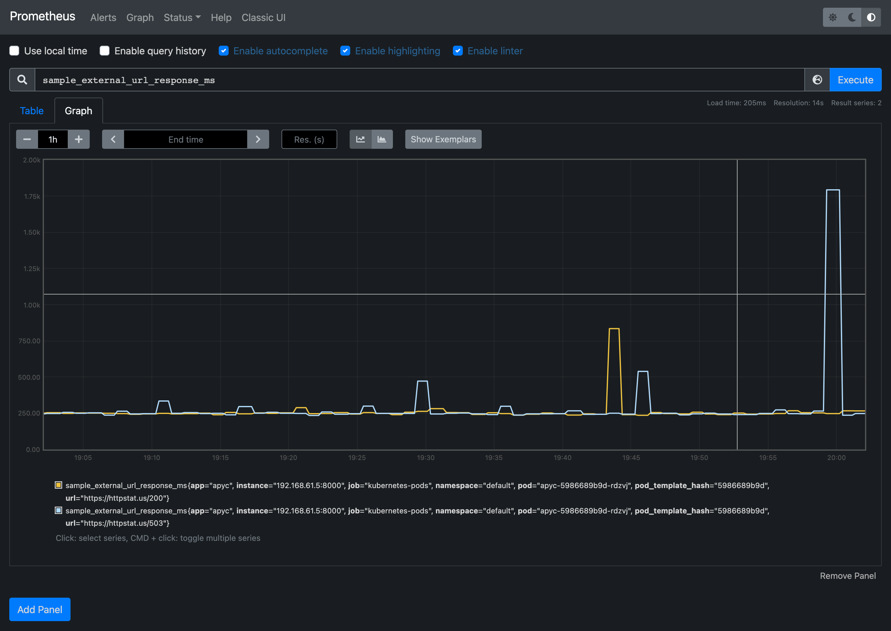
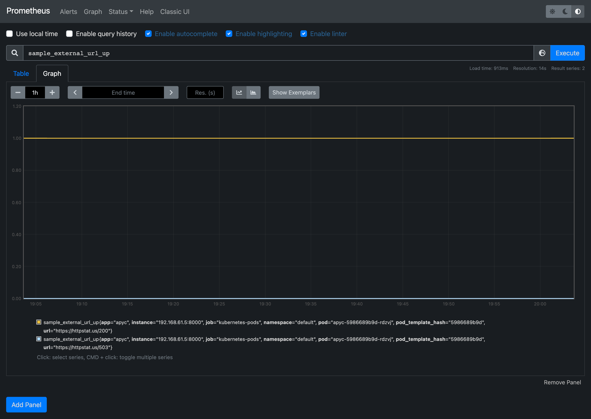
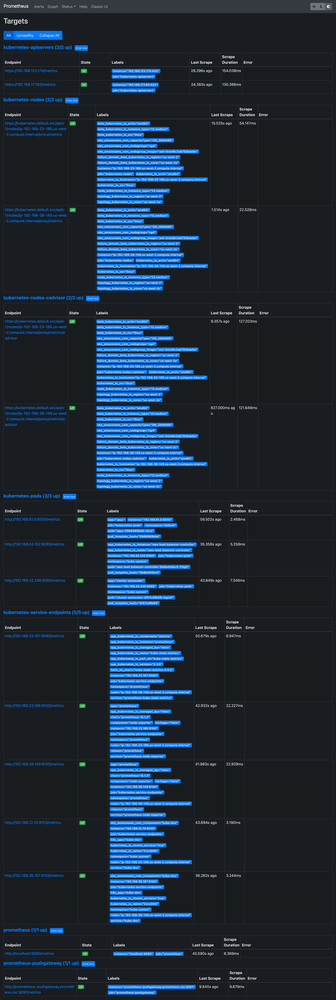

# apyc
Welcome to the `A Python Crawler (APyC)` for HTTP Endpoints repository.

Apyc repository holds a Python program that makes it easy to crawl two HTTP endpoints at the moment. APyC offers easy way to build and deploy the Python program on Kubernetes and monitor Prometheus format metrics using Prometheus Server and Grafana Dashboards.

What is an APyC?
--- 

APyC is just a abbreviation for `A Python Crawler` that abstracts the complexities of configuring a test python app to crawl HTTP endpoints and emit Prometheus format metrics.

What can I do with APyC?
--- 

You can use this repository as a sample design to run a Python application on Kubernetes Container based environment. Below are few features of APyC,

- [x] Simple service written in Python that queries 2 URL's (https://httpstat.us/503 & https://httpstat.us/200) every one second.
- [x] APyC checks if external URL's are up (based on http status code 200) and returns response time in milliseconds.
- [x] APyC runs a simple http server to emit Prometheus format metrics on path `/metrics` using Python Prometheus library.

Prometheus Metrics
--- 

- `0` = down and `1` = up
```
sample_external_url_up{url="https://httpstat.us/503 "}  = 0
sample_external_url_response_ms{url="https://httpstat.us/503 "}  = [value]
sample_external_url_up{url="https://httpstat.us/200 "}  = 1
sample_external_url_response_ms{url="https://httpstat.us/200 "}  = [value]
```

Getting Started
---

## prerequisites

- Docker
- make
- Kubernetes Cluster
- kubectl
- Helm version 3

## Run APyC on local machine

```
make run
```

## Run Unitest on local machine

```
make unit-test
```

## Deploy APyC to Kubernetes Cluster

- Configure kubectl configuration pointing to a Kubernetes Cluster
- Deploy APyC using make

    ```
    make k8s-deploy
    ```

## Setup Infrastructure

- Create a Kubernetes Cluster
- Install Prometheus

    ```
    kubectl create namespace prometheus

    helm install prometheus prometheus-community/prometheus \
    --namespace prometheus \
    --set alertmanager.persistentVolume.storageClass="gp2" \
    --set server.persistentVolume.storageClass="gp2"

    kubectl port-forward -n prometheus deploy/prometheus-server 8080:9090
    ```

- Install Grafana

    ```
    mkdir ${HOME}/environment/grafana

    cat << EoF > ${HOME}/environment/grafana/grafana.yaml
    datasources:
      datasources.yaml:
        apiVersion: 1
        datasources:
        - name: Prometheus
          type: prometheus
          url: http://prometheus-server.prometheus.svc.cluster.local
          access: proxy
          isDefault: true
    EoF

    kubectl create namespace grafana

    helm install grafana grafana/grafana \
        --namespace grafana \
        --set persistence.storageClassName="gp2" \
        --set persistence.enabled=true \
        --set adminPassword='EKS!sAWSome' \
        --values ${HOME}/environment/grafana/grafana.yaml \
        --set service.type=LoadBalancer

    export ELB=$(kubectl get svc -n grafana grafana -o jsonpath='{.status.loadBalancer.ingress[0].hostname}')

    echo "http://$ELB"

    kubectl get secret --namespace grafana grafana -o jsonpath="{.data.admin-password}" | base64 --decode ; echo
    ```

- Import APyC specific Grafana Dashboard
    - click the `+` icon in the side menu and then click Import.
    - From here you can upload the dashboard JSON file `config/grafana/APyC Metrics-dashboard.json`

- Deploy APyC on Kubernetes

    ```
    kubectl apply -f apyc-k8s-deployment.yml

    #OR

    make k8s-deploy
    ```

## APyC Prometheus Targets and Graphs

- `APyC Grafana Dashboard` screenshot below

    

- APyC Prometheus metric `sample_external_url_response_ms`

    

- APyC Prometheus metric `sample_external_url_up`

    

- APyC as Prometheus Target

    

--- 

Questions or Something not working?

Please feel free to raise a [GitHub issue](https://github.com/saiteja313/apyc/issues)